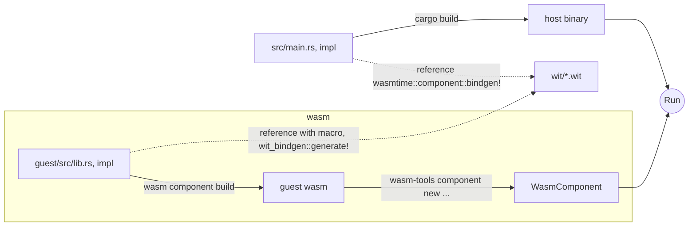

# wasm-load-basecamp

## warming up...
### generate wasm component
```
$ cargo component new hello-wasi-cli
```

### wasm component build
```
$ cargo component build -p hello-wasi-cli
```

### run the wasm
```
$ wasmtime target/wasm32-wasi/debug/hello-wasi-cli.wasm  
```

## define interface = create new 
### lib = include wit

```
$ cargo component new --lib wasm/greet
```
```
└── wasm
    ├── greet
    │   ├── Cargo.toml
    │   ├── src
    │   │   ├── bindings.rs
    │   │   └── lib.rs
    │   └── wit
    │       └── world.wit
    └── hello-wasi-cli
        ├── Cargo.toml
        └── src
            ├── bindings.rs
            └── main.rs
```

## Implement guest/host

### Overview
```
├── Cargo.lock
├── Cargo.toml
├── README.md
├── guest
│   ├── Cargo.toml
│   └── src
│       └── lib.rs(guest wasm app source)
├── guest.wasm(output)
├── src
│   └── main.rs(host app source)
├── target
└── wit
    └── host.wit (interface guest/host)
```




```bash
# build guest wasm (without wasi)
$ cargo build --release --target wasm32-unknown-unknown -p guest
# create wasm component
$ wasm-tools component new target/wasm32-unknown-unknown/release/guest.wasm -o guest.wasm
# build host application
$ cargo build --release
# run host/wasm
$ ./target/release/samplehost ./guest.wasm 
[Host]WasmLog: Hello
```

## Reference

https://zenn.dev/chikoski/articles/run-wasm-component-with-wasmtime-and-bindgen

https://qiita.com/fits/items/6e142cd0e7fd200476e8
