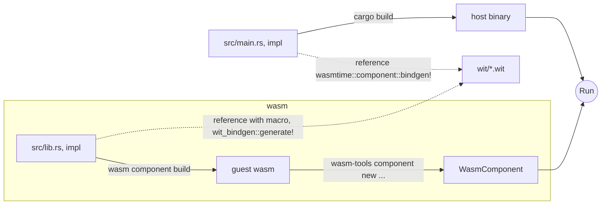

# wasm-load-basecamp

## warming up...
### generate wasm component
```
$ cargo component new hello-wasi-cli
```

### wasm component build
```
$ cargo component build -p hello-wasi-cli
```

### run the wasm
```
$ wasmtime target/wasm32-wasi/debug/hello-wasi-cli.wasm  
```

## define interface = create new 
### lib = include wit

```
$ cargo component new --lib wasm/greet
```
```
└── wasm
    ├── greet
    │   ├── Cargo.toml
    │   ├── src
    │   │   ├── bindings.rs
    │   │   └── lib.rs
    │   └── wit
    │       └── world.wit
    └── hello-wasi-cli
        ├── Cargo.toml
        └── src
            ├── bindings.rs
            └── main.rs
```

### create guest wasm lib and wit
```
src/
├── lib.rs
├── main.rs
└── wit
    └── host.wit
```

```
$ cargo add wit-bindgen
```

## (if have not installed wit-bindgen-cli)
```bash
$ cargo install wit-bindgen-cli
```

## generate host code (not need)
```bash
[~/wasm-load-basecamp/src]$wit-bindgen rust ../wit/host.wit 
```

## wasm component build
```bash
$ cargo component build
```
## 
```bash
[~/wasm-load-basecamp]$wasmtime target/wasm32-wasi/debug/wasm_load_basecamp.wasm 
Error: failed to run main module `target/wasm32-wasi/debug/wasm_load_basecamp.wasm`

Caused by:
    0: component imports function `print`, but a matching implementation was not found in the linker
    1: function implementation is missing
```



```
├── Cargo.lock
├── Cargo.toml
├── README.md
├── guest
│   ├── Cargo.toml
│   └── src
│       └── lib.rs(guest wasm app source)
├── guest.wasm(output)
├── src
│   └── main.rs(host app source)
├── target
├── wasm(not use)
└── wit
    └── host.wit (interface guest/host)
```


```bash
# build guest wasm
$ cargo build --release --target wasm32-unknown-unknown -p guest
# create wasm component
$ wasm-tools component new target/wasm32-unknown-unknown/release/guest.wasm -o guest.wasm
# build host application
$ cargo build --release
# run host/wasm
$ ./target/release/samplehost ./guest.wasm 
[Host]WasmLog: Hello
```